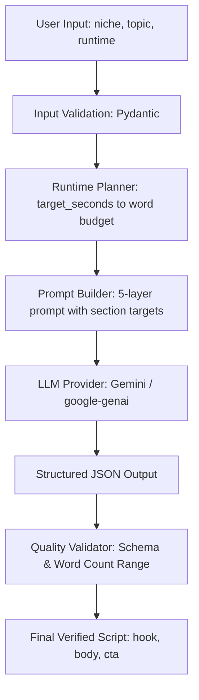

# Script Bench

Script Bench converts a niche, topic, and target runtime into a short-form video script using an LLM paired with deterministic runtime and quality constraints.

---

## Overview

Developed for Phase 1 of the Zypit Software Development Internship assignment, Script Bench is a command-line script generator designed to turn raw video ideas into film-ready short-form scripts. It is built as a focused, production-minded engineering pipeline rather than an all-in-one content platform.

---

## Problem

Generating a practical short-form script is not as simple as passing a topic directly into an LLM (`topic → LLM → output`). 

In short-form video (15–60 seconds), content must balance multiple competing tensions simultaneously:
- **Viewer Attention**: Earning watch time within the first two seconds without resorting to empty clickbait.
- **Clarity & Information Density**: Communicating real substance within tight constraints rather than skimming five topics superficially.
- **Spoken Delivery**: Writing for natural speech with conversational cadence, contractions, and natural pauses rather than reading like an essay or article.
- **Pacing & Runtime**: Fitting a calculated spoken duration without arbitrary truncation.
- **Structural Integrity**: Providing cleanly isolated sections (`hook`, `body`, `cta`) that video editors or creators can parse and record directly.
- **Factual Restraint**: Avoiding invented statistics, artificial urgency, or overstating general tendencies as universal laws.

An unconstrained prompt frequently violates these boundaries. Script Bench introduces deterministic engineering controls to enforce them reliably.

---

## Architecture



### Component Responsibilities
- **Input Validation ([models.py](src/script_bench/models.py))**: Strips whitespace and enforces valid boundaries ($15 \le \text{seconds} \le 180$, lengths) using Pydantic before any downstream processing.
- **Runtime Planner ([planner.py](src/script_bench/planner.py))**: Derives mathematical word budgets ($\text{words} = \text{seconds} \times 2.35$, $\pm 8\%$ tolerance) treating runtime as a first-class input.
- **Prompt Builder ([prompts.py](src/script_bench/prompts.py))**: Assembles system principles (spoken cadence, anti-cliché rules, calibrated claims) with runtime-specific pacing breakdowns into a structured prompt.
- **LLM Provider ([provider.py](src/script_bench/provider.py))**: Encapsulates model communication behind an abstract [LLMProvider](src/script_bench/provider.py#L21) interface. In Phase 1, `GeminiProvider` requests structured JSON directly via `google-genai`.
- **Quality Validator ([validator.py](src/script_bench/validator.py))**: Deterministically checks that all required fields exist, contain non-empty strings, conform to the schema, and that total words fall strictly within the planned budget.
- **Orchestration ([generator.py](src/script_bench/generator.py))**: Manages the pipeline end-to-end and returns guaranteed [ScriptOutput](src/script_bench/models.py#L22) contracts.

---

## Design Principle

> **LLM for creativity, deterministic code for constraints.**

Large Language Models excel at contextual tone, creative angles, conversational variety, and domain-appropriate language. However, they are unreliable at self-policing hard mechanical limits such as exact word budgets, strictly valid schemas, or non-empty fields.

Script Bench delegates linguistic nuance and conceptual framing to the LLM, but enforces input boundaries, output structures, and runtime budgets deterministically in code. If an output violates a structural rule or word budget, the system fails closed with a clear [ScriptValidationError](src/script_bench/validator.py#L10) rather than emitting an unusable script.

---

## Input

Input is provided via CLI flags or interactive prompts with the following schema:

```json
{
  "niche": "personal finance",
  "topic": "Why automating savings is easier than relying on willpower",
  "target_seconds": 30
}
```

- `niche` (string, 2–100 chars): Creator's subject area; drives vocabulary and depth.
- `topic` (string, 5–500 chars): Central video idea or premise.
- `target_seconds` (integer, 15–180): Desired video duration.

---

## Output

Script Bench outputs strictly formatted, unadorned JSON:

```json
{
  "hook": "Deciding to save money manually forces your brain to make a conscious, painful sacrifice every single month.",
  "body": "Automating that transfer on payday removes this daily friction entirely. Because those funds move before you can spend them, your mind naturally treats the remaining balance as your actual budget, which bypasses the need for willpower.",
  "cta": "Set up one small, automatic transfer today and watch how quickly your habits adjust."
}
```

### Field Responsibilities
- **`hook`**: Opening line (~15–20 words) that earns immediate watch time through an observation, counterintuitive insight, or concrete problem without generic channel greetings.
- **`body`**: Core section developing exactly **one** central idea using a concrete mechanism or practical consequence.
- **`cta`**: Single concise closing sentence (~8–15 words) providing one clear next action, reflection, or experiment directly relevant to the topic.

---

## Runtime Planning

The runtime planner converts video duration into an approximate spoken-word budget:

$$\text{approximate words} = \text{target\_seconds} \times 2.35$$
$$\text{min\_words} = \text{round}(\text{target} \times 0.92), \quad \text{max\_words} = \text{round}(\text{target} \times 1.08)$$

| Duration | Target Words | Allowed Budget Range ($\pm 8\%$) |
|:---|:---:|:---:|
| **30 seconds** | ~71 words | 65–77 words |
| **45 seconds** | ~106 words | 98–114 words |
| **60 seconds** | ~141 words | 130–152 words |

> **Note on Approximation**: Word count is an engineering proxy, not an absolute guarantee of acoustic duration. Human speech varies with emphasis, pauses, and pacing. The budget functions as a bounded guardrail to keep content realistic for the creator's planned runtime.

---

## Prompt Design

The prompt architecture is split into a static system prompt and dynamic input brief:
- **Spoken-First Delivery**: Explicitly instructs conversational syntax, natural contractions, and varied sentence rhythms for on-camera delivery.
- **Immediate Hooks**: Forbids introductory filler ("In this video...", "Do you ever...") in favor of direct opening insights.
- **Single Central Idea**: Constrains the body to one developed mechanism rather than an unfocused list of bullet points.
- **Factual Precision & Calibrated Language**: Prohibits turning general tendencies into universal rules; encourages calibrated language (*often, typically, can, tends to*).
- **Domain Restraint**: Strictly forbids inventing statistics, research citations, expert quotes, or medical/financial guarantees.
- **Single-Action CTA**: Enforces exactly one single-sentence action without secondary explanations.
- **Anti-Cliché Pass**: Silently scans and removes overused social media tropes (*"It's not magic"*, *"Game changer"*, *"The secret is"*, *"Stop scrolling"*).

---

## Validation

Script Bench separates deterministic code checks from LLM-dependent quality evaluations:

### Deterministic Checks (Verified in Code)
- Input string stripping and range checks ($15 \le \text{seconds} \le 180$).
- Valid JSON object parsing.
- Existence of all required fields (`hook`, `body`, `cta`).
- Strict non-empty string validation.
- Total word count validation against the planned range ($[\text{min\_words}, \text{max\_words}]$).

### LLM-Dependent Quality (Guided via Prompting)
- Conceptual strength and novelty of the hook.
- Rhetorical pacing and naturalness of conversational phrasing.
- Topic alignment and domain depth.
- Avoiding subtle clichés or repetitive phrasing across generations.

---

## Why Not a Frontend?

Phase 1 evaluates script generation quality, architectural separation, constraint enforcement, and code design. Implementing a web UI or CMS would add frontend dependencies and boilerplate without improving script quality or engineering rigor. The generator is kept presentation-independent so any UI, API, or automation pipeline can integrate it without refactoring.

---

## Project Structure

```
script-bench/
├── src/
│   ├── __init__.py
│   └── script_bench/
│       ├── __init__.py          # Public package exports
│       ├── models.py            # Pydantic input and output contracts
│       ├── planner.py           # Runtime-to-word-budget calculation
│       ├── prompts.py           # System & dynamic prompt builder
│       ├── provider.py          # LLM provider abstraction & Gemini client
│       ├── generator.py         # Pipeline orchestrator
│       ├── validator.py         # Deterministic schema & word budget checks
│       └── main.py              # CLI entry point (flags & interactive)
├── tests/
│   ├── __init__.py
│   ├── test_planner.py          # Planner math & boundary tests
│   ├── test_prompts.py          # Prompt assembly & directive tests
│   └── test_validator.py        # Schema & word count validation tests
├── samples/
│   ├── README.md                # Sample descriptions & commands
│   ├── 01_personal_finance_30s.json
│   ├── 02_productivity_60s.json
│   ├── 03_technology_45s.json
│   ├── 04_career_30s.json
│   └── 05_food_45s.json
├── README.md                    # Project documentation
├── DESIGN_NOTE.md               # Architectural rationale & trade-offs
├── requirements.txt             # Minimal dependencies
├── .env.example                 # Environment configuration template
└── .gitignore                   # Excludes .env, caches, and build artifacts
```

---

## Setup & Installation

### 1. Prerequisites
- Python 3.10+ (tested on Python 3.12 and 3.13)
- Gemini API Key

### 2. Clone and Setup Environment
```bash
cd script-bench
python -m venv .venv

# Activate environment:
# Windows (PowerShell):
.venv\Scripts\Activate.ps1
# Linux/macOS:
source .venv/bin/activate
```

### 3. Install Dependencies
```bash
pip install -r requirements.txt
```

### 4. Configure Environment Variables
Copy `.env.example` to `.env` and insert your Gemini API key:
```bash
cp .env.example .env
```
Inside `.env`:
```env
GEMINI_API_KEY=your_gemini_api_key_here
GEMINI_MODEL=gemini-2.5-flash
```

---

## Running Tests

The test suite runs **100% offline** with zero API calls and zero network requests:

```bash
pytest -v
```

Expected output:
```text
tests/test_planner.py::test_runtime_plan_30_seconds PASSED
tests/test_planner.py::test_runtime_plan_ranges_30_45_60 PASSED
tests/test_prompts.py::test_build_prompt_includes_inputs PASSED
tests/test_prompts.py::test_build_prompt_enforces_anti_cliche_and_spoken_rules PASSED
tests/test_prompts.py::test_build_prompt_enforces_factual_precision_and_calibrated_claims PASSED
tests/test_prompts.py::test_build_prompt_enforces_cta_discipline PASSED
tests/test_prompts.py::test_build_prompt_contains_exact_json_shape PASSED
tests/test_validator.py::test_invalid_schema PASSED
tests/test_validator.py::test_missing_field PASSED
tests/test_validator.py::test_non_string_field PASSED
tests/test_validator.py::test_word_count_below_range PASSED
tests/test_validator.py::test_word_count_above_range PASSED
tests/test_validator.py::test_valid_output_within_range PASSED
tests/test_validator.py::test_input_contract_target_seconds_bounds PASSED
tests/test_validator.py::test_input_contract_whitespace_stripping PASSED

============================= 15 passed in 0.66s ==============================
```

---

## Usage Example

### Command-Line Execution
```bash
python -m src.script_bench.main \
  --niche "personal finance" \
  --topic "Why automating savings is easier than relying on willpower" \
  --target-seconds 30
```

### Interactive Execution
Running without arguments prompts step by step:
```bash
python -m src.script_bench.main
```

### Output
The CLI prints only clean JSON to `stdout`:
```json
{
  "hook": "Deciding to save money manually forces your brain to make a conscious, painful sacrifice every single month.",
  "body": "Automating that transfer on payday removes this daily friction entirely. Because those funds move before you can spend them, your mind naturally treats the remaining balance as your actual budget, which bypasses the need for willpower.",
  "cta": "Set up one small, automatic transfer today and watch how quickly your habits adjust."
}
```

> **Note**: All sample files in `samples/` are raw, unedited outputs generated directly by the program through this CLI.

---

## Official Samples

The five official raw benchmark outputs are located in `samples/`:
- **[01_personal_finance_30s.json](samples/01_personal_finance_30s.json)** (30s, 67 words): Automating savings vs. willpower friction.
- **[02_productivity_60s.json](samples/02_productivity_60s.json)** (60s, 138 words): Context-switching penalty and attention residue.
- **[03_technology_45s.json](samples/03_technology_45s.json)** (45s, 106 words): Understanding API status codes and protocols vs. relying blindly on AI-generated integrations.
- **[04_career_30s.json](samples/04_career_30s.json)** (30s, 68 words): Aligning resume keywords with specific internship job descriptions.
- **[05_food_45s.json](samples/05_food_45s.json)** (45s, 107 words): Preheating pans to flash off surface moisture and caramelize vegetables instead of steaming.

---

## Engineering Decisions

| Decision | Rationale |
|:---|:---|
| **Structured JSON Contract** | Enforces a predictable schema (`hook`, `body`, `cta`) suitable for automated processing or downstream UI integration. |
| **Runtime Planner** | Calculates a bounded word target before generation so duration is designed in rather than trimmed after the fact. |
| **Provider Abstraction** | Decouples orchestration from model SDKs via `LLMProvider`, keeping core logic independent of vendor APIs. |
| **Deterministic Validation** | Catches structural defects and length violations in code before emitting artifacts. |
| **Prompt Pacing Guidance** | Allocates section-level word targets dynamically to prevent premature completion on longer runtimes. |
| **CLI-First Interface** | Focuses development time on generation quality, test coverage, and constraint handling rather than UI plumbing. |

---

## Trade-offs

- **Word Count as a Proxy**: Word count is an approximation of speech duration. Individual delivery pacing varies; the budget is a guardrail rather than an acoustic clock.
- **Stochasticity vs Determinism**: Model responses vary across calls. While the prompt guides style and tone, code validation guarantees structure and bounds.
- **Single Candidate Generation**: To keep Phase 1 lean and responsive, the system generates a single candidate rather than ranking multiple drafts.
- **CLI vs Full Interface**: Prioritizing core engine design and automated tests over a graphical user interface.
- **Provider Dependency**: Generation requires an active Gemini API key; offline testing is fully decoupled and incurs zero cost.

---

## Future Extensions

1. **Multi-Candidate Scoring**: Generate 3 candidate variations in parallel and rank them against heuristic criteria (hook novelty, conciseness, rhythm).
2. **Granular Tone & Platform Controls**: Add parameters for tone (conversational, authoritative) and platform (YouTube Shorts, TikTok, Reels).
3. **Multi-Provider Adapters**: Add implementations for `OpenAIProvider`, `AnthropicProvider`, or local open-weight models.
4. **HTTP API**: Expose `POST /generate` via FastAPI for web or mobile clients.
5. **Automated Semantic Evaluation**: Benchmark prompt variations against offline golden datasets.

---

## Assignment Deliverables

```text
source code  ──>  src/
tests        ──>  tests/
samples      ──>  samples/
README       ──>  README.md
design note  ──>  DESIGN_NOTE.md
demo video   ──>  submitted separately
```
